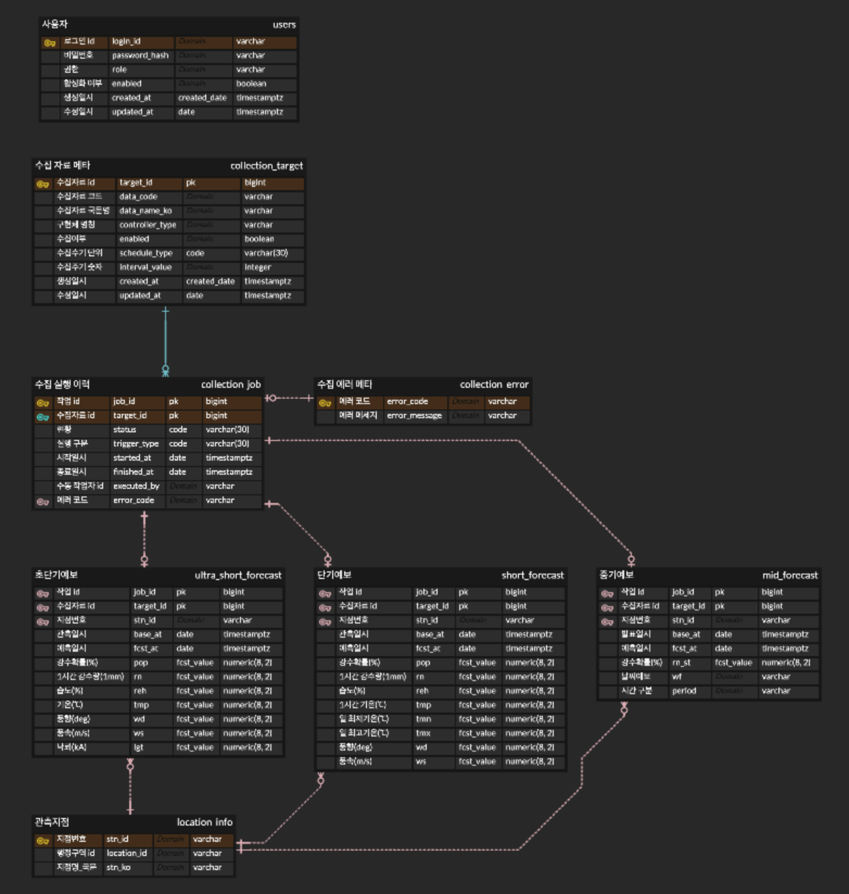

# 데이터베이스 설계

> 기준 버전: v0.1

## 전체 ERD

이미지를 클릭하면 CloudERD 원본 화면으로 이동한다.

## 설계 범위

현재 ERD는 다음 영역을 포함한다.

- 사용자 및 권한
- 외부 API 수집 대상
- 수집 스케줄
- 수집 실행 이력
- 외부 API별 원본 또는 정규화 데이터

## 주요 관계

- 하나의 수집 대상은 여러 수집 실행 이력을 가진다.
- 하나의 수집 실행은 성공 또는 실패 결과를 가진다.
- API별 관측 데이터는 수집 실행 이력을 참조해 어떤 실행으로 저장됐는지 추적한다.